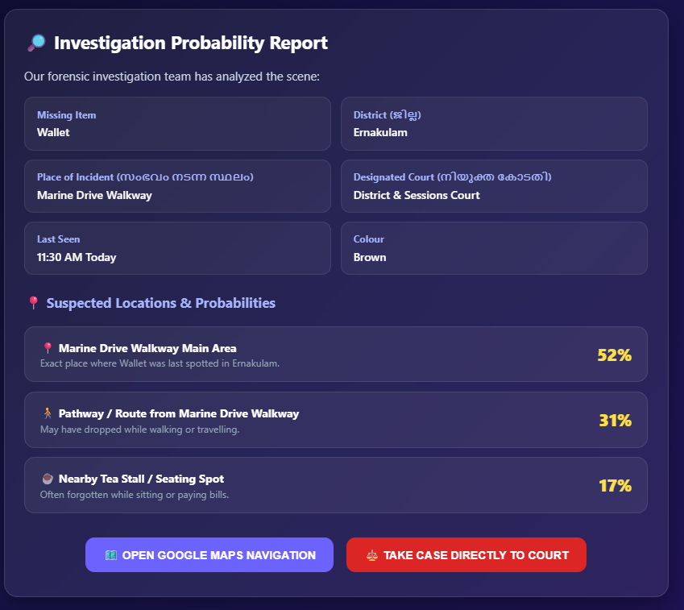
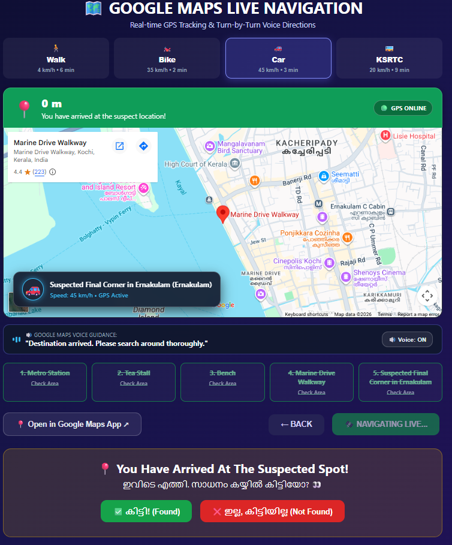
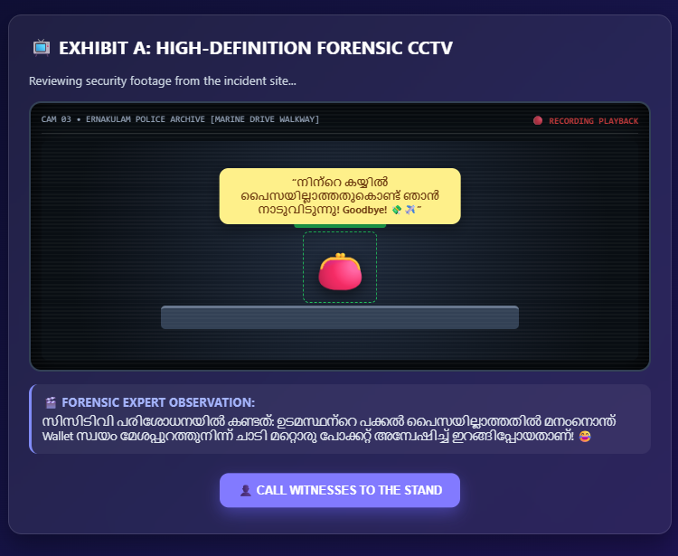
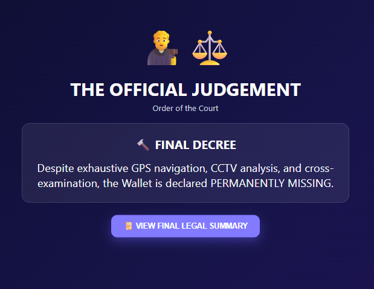
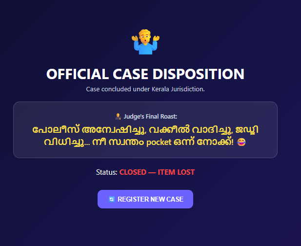

# സാധനം കയ്യിലുണ്ടോ 🎯

## Basic Details
### Team Name: സാധനം കയ്യിലുണ്ടോ

### Team Members
- Team Lead: Thaarika Bijai - St.Joseph College of Engineering and Technology,Palai 
- Member 2: Manasseh George - St.Joseph College of Engineering and Technology,Palai 

### Project Description
AI-based lost-item finder that predicts where missing objects may be using user history and location data, with real Google Maps navigation, simulated CCTV, witnesses, and a fun courtroom verdict

### The Problem (that doesn't exist)
What if your pen, wallet, phone, umbrella or any random object decides to disappear, and instead of simply looking for it, you launch a full-scale AI investigation?”

The problem is basically overthinking a simple lost-item situation. Instead of checking your bag, desk, or pocket first, our system uses AI prediction, Google Maps, detective-style investigation, simulated CCTV, witnesses and even a courtroom to find out where the missing object might be.

### The Solution (that nobody asked for)
We built “സാധനം കയ്യിലുണ്ടോ?” — an unnecessarily advanced solution to an unnecessarily simple problem.
Instead of simply searching around, our system launches a full detective investigation: AI makes a wild guess, Google Maps takes you on the route, CCTV creates suspicious evidence, witnesses are questioned, and finally a judge delivers the ultimate verdict. ⚖️🔍😂

Because sometimes a missing pen doesn't need a solution… it needs a whole criminal investigation. 🖊️🚨

## Technical Details
### Technologies/Components Used
For Software:
- HTML5
- CSS3
- JavaScript
- Google Maps JavaScript API
- Web Speech API
- Browser Local Storage
- Responsive Web Design

For Hardware:
- No dedicated hardware required
- Smartphone/Laptop/Desktop
- Internet connection
- GPS/Location access (for map-based navigation)

### Implementation
For Software:
# Installation
1. Download or clone this repository.
2. Open the project folder.
3. Add the required Google Maps API key in the JavaScript configuration.
4. Make sure internet access is available.

# Run
Open the index.html file in a web browser.

For the best experience, run the project using a local server such as:
- VS Code Live Server
- GitHub Pages
- Any local HTTP server

### Project Documentation
For Software:

# Screenshots (Add at least 3)

  — Item Details & Investigation
User enters the missing item's details, last-seen location, time, places visited, and other information required for the investigation.

  
— Google Maps Navigation
Real Google Maps guides the user through the selected locations and routes to the system’s predicted destination.

— Digital Courtroom
The missing-item case enters the digital courtroom, where simulated CCTV evidence, witness statements, and a final judgment are presented.

# Diagrams
flowchart TD
    A[Start] --> B[Enter Missing Item Details]
    B --> C[Enter Last Seen Location & Time]
    C --> D[Enter Places Visited & Route History]
    D --> E[AI-Based Analysis]
    E --> F[Predict Probable Location]
    F --> G[Real Google Maps Navigation]
    G --> H{Item Found?}
    H -->|Yes| I[Case Solved 🎉]
    H -->|No| J[Digital Courtroom]
    J --> K[Simulated CCTV Evidence]
    K --> L[Witness Examination]
    L --> M[Evidence Analysis]
    M --> N[Final Judgment ⚖️]
This flowchart illustrates the complete workflow of “സാധനം കയ്യിലുണ്ടോ?”, from entering missing-item details and AI-based location prediction to Google Maps navigation, CCTV investigation, witness examination, and the final courtroom verdict.

For Hardware:

# Schematic & Circuit
Not applicable. This is a software-based project and does not require dedicated hardware.

Not applicable — the project is implemented as a web-based software application.

# Build Photos

Basic Information Component 📝
Missing item name/type
Colour, size, photo
Last-seen location and time
History & Location Input Component 📍
Places visited
Route/history
People present
Additional clues/context
AI Prediction Component 🔍
Analyse the entered information
Calculate probable locations
Display the final “wild guess”
Google Maps Navigation Component 🗺️
Show real Google Maps
Navigate through entered locations
Guide towards the predicted location
Location Verification Component ✅
Ask: “Did you find the item?”
Found → case solved
Not found → continue investigation
Detective Investigation Component 🕵️
Case file
Investigation progress
Clues and probability information
Courtroom Component ⚖️
Judge
Case details
Court progress
Simulated CCTV Component 📹
Item-specific funny scenarios
Pen rolling away, wallet escaping, phone hiding, etc.
Reconstructed/simulated footage
Witness Component 👥
Multiple witnesses
Witness statements
Evidence examination
Final Verdict Component ⚖️
Item found → Case Solved 🎉
Item missing → Case Closed 😂
Funny judge/roast dialogue

Step 1 — Design the User Interface
First, create the main web interface where the user can enter details about the missing item, such as its name, type, colour, size, photo, last-seen location and time.

Step 2 — Collect Investigation Details
Add fields for places visited, route history, people present and other clues. This gives the system more information to work with.

Step 3 — Develop the Prediction Logic
Process the entered information using JavaScript logic to analyse the clues and generate a probable location for the missing item.

Step 4 — Integrate Google Maps
Connect the project with Google Maps and create route-based navigation through the locations entered by the user, eventually leading towards the predicted location.

Step 5 — Add Location Verification
At each destination, ask the user whether the item was found. If found, the case is solved. If not, the investigation continues.

Step 6 — Build the Detective & Courtroom System
If the item remains missing, move the case into the digital courtroom. Add the judge, case file, evidence and investigation progress.

Step 7 — Add Simulated CCTV Evidence
Create funny, item-specific reconstructed CCTV scenes—for example, a pen rolling away, a wallet escaping, or a phone hiding.

Step 8 — Add Witnesses & Final Verdict
Introduce witnesses and their statements, analyse the evidence, and finally generate a courtroom judgment: item found or case closed. ⚖️😂

Final Build

The final build is a fully functional web-based prototype of “സാധനം കയ്യിലുണ്ടോ?”. The system allows the user to enter details about a missing item, including its name, appearance, last-seen location, time, places visited, route history, and other relevant information.
The system then analyses the given information and generates a probability-based wild guess of where the item may be. The user can follow the investigation through the navigation interface and verify the suggested locations.

If the item is still not found, the investigation moves to a digital courtroom, where simulated CCTV evidence, witnesses, evidence analysis, and a final verdict are presented.

The final prototype combines AI-inspired reasoning, location-based navigation, interactive UI, detective-style investigation, and gamification to solve a deliberately ridiculous problem in an unnecessarily advanced way. 🔍🗺️📹⚖️😂

### Project Demo
# Video
## 🎥 Demo Video

  <video controls width="800">
    <source src="20260912-0017-13.5144396.mp4" type="video/mp4">
  </video>

[▶️ Watch the Demo Video on YouTube](https://youtu.be/USQLA7ze4sE)
Missing Item Input – The user enters details about the lost item and its last-known information.
AI-Based Analysis – The system analyses the provided details and gives a probability-based prediction of where the item may be.
Navigation – The user is guided through the entered locations and predicted destination.
Location Verification – The user checks each suggested location to see whether the item is found.
Detective Investigation – If the item is still missing, the system continues the investigation.
Courtroom & CCTV – The case moves to a digital courtroom with simulated CCTV evidence and investigation.
Witnesses & Verdict – Witness statements are presented, followed by a final verdict showing whether the item was found or remains missing.

# Additional Demos

  <video controls width="800">
    <source src="navi.mp4" type="video/mp4">
  </video>

[▶️ Watch the Demo Video on YouTube](https://youtu.be/IgZjKJLrPNc)

## Team Contributions
- Thaarika Bijai: - Project concept and workflow design
- User input and prediction logic
- Detective and courtroom UI
- Presentation and demo preparation

- Manasseh George: - Navigation and location features
- Simulated CCTV and evidence
- Witness and verdict modules
- Testing, animations and integration

---
Made with ❤️ at TinkerHub Useless Projects 

